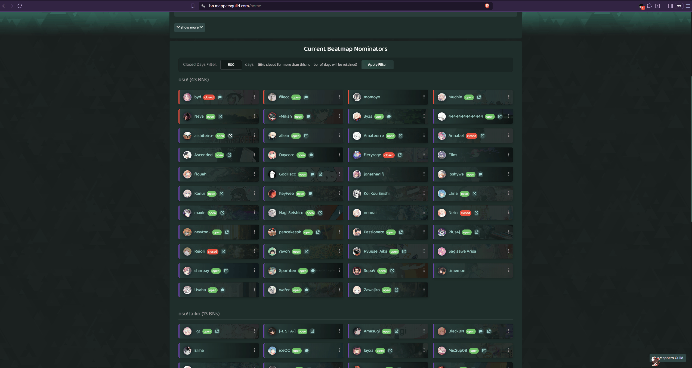

# BNM Enhanced

A userscript that

- Shows only opened BNs in [BN Management](https://bn.mappersguild.com/) lists
  - User can configure the lists to also show BNs that have been closed for more than N days
- Changes the lists to grid of cards--Easier to view at once and more aesthetic
- Removes fade-in and fade-out animations when toggling Information Dialogs
- Clear the URL when Information Dialog is closed

 

Filtered vs Original:



<!-- TODO: add true post here -->
~~Check out the Forum post [Development > BNM-Enhanced | user script](https://osu.ppy.sh/community/forums/topics/2145958?n=1).~~

## Installation

1. Install a userscript manager like [Tampermonkey](https://www.tampermonkey.net/) or [Greasemonkey](https://www.greasespot.net/)
2. Install the userscript:
   - [Raw File Link](https://raw.githubusercontent.com/SisypheOvO/BNM-Enhanced/main/dist/bnm-enhanced.user.js)
3. Visit [BN Management](https://bn.mappersguild.com/) homepage to see it in action. You are all set then.
4. make sure to turn on AutoUpdate in your userscript manager to get the latest updates.

    

## Contributing

Feel free to submit issues and pull requests to improve the script.

### Development

```bash
npm i # install dependencies
npm run build # build the userscript
```

## TODO

- [x] Fix routing when UserCard clicked
- [x] Improve BN List style
- [ ] Maybe add a button for toggling
